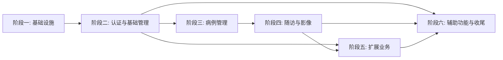

# 实施计划 — EKSJK V2 全栈重构项目

> **项目概述**：EKSJK（儿科生长发育数据管理系统）V2 全栈重构，从 Python Django + Vue 2 迁移至 Java Spring Boot 3.x + Vue 3 + uni-app 微信小程序。
> **总体规划**：分 6 个阶段实施，每个阶段产出独立可运行的交付物，阶段间存在依赖关系。
> **任务清单说明**：每次只执行一个阶段的任务，完成后再进入下一阶段。每个阶段的详细任务清单已独立存放在对应的 `task-item-phaseN.md` 文件中。

---

## 阶段依赖关系

---

## 阶段一：基础设施搭建（9 个任务）

> **对应需求**：需求 1、2、3
> **详细任务清单**：见 [`task-item-phase1.md`](./task-item-phase1.md)
> **前置依赖**：无

- [ ] 1. 创建后端 Maven 多模块项目骨架 — _需求：1.1、1.2_
- [ ] 2. 配置后端基础组件与多环境配置 — _需求：1.3、1.4、1.5、1.6_
- [ ] 3. 实现后端统一响应格式与全局异常处理 — _需求：3.1、3.2、3.3、3.4、3.5_
- [ ] 4. 实现后端 Hashids 工具类与基础工具模块 — _需求：1.1、4.1_
- [ ] 5. 创建 PC 端前端 Vue 3 项目骨架 — _需求：2.1、2.2、2.3、2.4_
- [ ] 6. 建立前端全局设计规范与样式体系 — _需求：2.6_
- [ ] 7. 封装前端 Axios 请求模块与统一错误处理 — _需求：2.5、3.6、3.7、3.8_
- [ ] 8. 开发前端通用基础组件 — _需求：2.7_
- [ ] 9. 配置前端路由基础结构与路由守卫 — _需求：2.1、3.7_

---

## 阶段二：认证与基础管理（12 个任务）

> **对应需求**：需求 4（认证与权限）、需求 5（用户管理）、需求 6（机构管理）、需求 7（PC 端布局与交互）
> **详细任务清单**：见 [`task-item-phase2.md`](./task-item-phase2.md)
> **前置依赖**：阶段一全部完成

- [ ] 1. 实现后端用户 Entity 与认证登录 API — _需求：4.2、5.1_
- [ ] 2. 实现后端角色权限控制与数据范围过滤 — _需求：4.3、14.6_
- [ ] 3. 实现后端医疗机构管理 API — _需求：6.1、6.2、6.3、6.4、6.5_
- [ ] 4. 实现后端用户管理 API — _需求：5.2、5.3、5.4、5.5_
- [ ] 5. 实现 PC 端主布局框架 — _需求：7.1、7.3_
- [ ] 6. 实现 PC 端动态菜单与权限路由 — _需求：7.2、7.3_
- [ ] 7. 实现 PC 端登录页面 — _需求：4.2（前端部分）_
- [ ] 8. 实现 PC 端用户管理页面 — _需求：5.2、5.3、5.4_
- [ ] 9. 实现 PC 端医疗机构管理页面 — _需求：6.2、6.3、6.4、6.5_
- [ ] 10. 实现 PC 端个人中心页面 — _需求：5.5_
- [ ] 11. 实现 PC 端工作台首页 — _需求：7.4_
- [ ] 12. 实现后端 CORS 跨域配置与前后端联调验证 — _需求：14.6_

---

## 阶段三：核心业务 — 病例管理（10 个任务）

> **对应需求**：需求 8（患者病例管理）
> **详细任务清单**：见 [`task-item-phase3.md`](./task-item-phase3.md)
> **前置依赖**：阶段二全部完成

- [ ] 1. 实现后端患者主表 Entity 与 Mapper — _需求：8.2_
- [ ] 2. 实现后端 7 种疾病子表 Entity 与 Mapper — _需求：8.4_
- [ ] 3. 实现后端病例管理 Service 层 — _需求：8.1、8.3_
- [ ] 4. 实现后端病例管理 Controller 层与数据导出 — _需求：8.1、8.5_
- [ ] 5. 实现 PC 端病例列表页面 — _需求：8.1（前端部分）_
- [ ] 6. 实现 PC 端病例详情页面 — _需求：8.1、8.2_
- [ ] 7. 实现 PC 端 DSD 和 FSS 疾病表单组件 — _需求：8.3、8.4_
- [ ] 8. 实现 PC 端 CPP、MAS、SGA 疾病表单组件 — _需求：8.3、8.4_
- [ ] 9. 实现 PC 端 SSS、ELTM 疾病表单组件 — _需求：8.3、8.4_
- [ ] 10. 实现 PC 端数据导出与批量操作功能 — _需求：8.5_

---

## 阶段四：核心业务 — 随访与影像（8 个任务）

> **对应需求**：需求 9（随访管理）、需求 10（医学影像处理）
> **详细任务清单**：见 [`task-item-phase4.md`](./task-item-phase4.md)
> **前置依赖**：阶段三全部完成

- [ ] 1. 实现后端随访数据模型与 Mapper — _需求：9.1_
- [ ] 2. 实现后端随访管理 Service 与 Controller — _需求：9.2_
- [ ] 3. 实现后端文件上传与影像管理 API — _需求：10.1、10.2、10.3、10.4、10.5_
- [ ] 4. 实现 PC 端随访记录列表与时间线展示 — _需求：9.2（前端部分）_
- [ ] 5. 实现 PC 端随访表单（通用 + MAS 专用） — _需求：9.2（前端部分）_
- [ ] 6. 实现 PC 端影像文件上传与管理 — _需求：10.6、10.9_
- [ ] 7. 实现 PC 端 DICOM 影像专业查看器 — _需求：10.7、10.8_
- [ ] 8. 前后端联调验证：随访与影像完整流程 — _需求：9、10_

---

## 阶段五：扩展业务模块（11 个任务）

> **对应需求**：需求 11（学校健康筛查）、需求 12（小程序家长端）、需求 13（小程序医生端）
> **详细任务清单**：见 [`task-item-phase5.md`](./task-item-phase5.md)
> **前置依赖**：阶段二（认证与基础管理）；需求 13 还依赖阶段三和阶段四

- [ ] 1. 实现后端学校健康筛查 API — _需求：11.1、11.2、11.3、11.4、11.5_
- [ ] 2. 实现 PC 端学校健康筛查页面 — _需求：11.6、11.7、11.8、11.9_
- [ ] 3. 创建小程序家长端项目骨架 — _需求：12.1、12.7_
- [ ] 4. 实现后端微信授权登录与家长用户 API — _需求：12.2、12.3_
- [ ] 5. 实现小程序家长端核心页面（登录 + 首页 + 宝宝管理） — _需求：12.2、12.4_
- [ ] 6. 实现后端身高评测与生长记录 API + 医生绑定 API — _需求：12.5、12.6_
- [ ] 7. 实现小程序家长端评测、记录、个人中心页面 — _需求：12.5、12.6、12.7_
- [ ] 8. 创建小程序医生端项目骨架 — _需求：13.1、13.9_
- [ ] 9. 实现后端医生端登录与工作台 API — _需求：13.2、13.3、13.7_
- [ ] 10. 实现小程序医生端核心页面（登录 + 工作台 + 患者列表） — _需求：13.2、13.3、13.4、13.5_
- [ ] 11. 实现小程序医生端随访、审核、统计页面 — _需求：13.6、13.7、13.8、13.9_

---

## 阶段六：辅助功能与收尾（10 个任务）

> **对应需求**：需求 14（通知反馈 + 统计分析 + 操作日志 + 数据库兼容与迁移 + 部署运维）
> **详细任务清单**：见 [`task-item-phase6.md`](./task-item-phase6.md)
> **前置依赖**：阶段四、阶段五全部完成

- [ ] 1. 实现后端通知公告与意见反馈 API — _需求：14.1_
- [ ] 2. 实现 PC 端通知公告与意见反馈页面 — _需求：14.1（前端部分）_
- [ ] 3. 实现后端统计分析 API — _需求：14.2_
- [ ] 4. 实现 PC 端统计分析仪表盘页面 — _需求：14.2（前端部分）_
- [ ] 5. 实现后端操作日志与审计功能 — _需求：14.3_
- [ ] 6. 实现 PC 端操作日志查看页面 — _需求：14.3（前端部分）_
- [ ] 7. 实现数据库表结构兼容性设计与 SQL 脚本 — _需求：14.4.1_
- [ ] 8. 实现数据导入脚本（基础数据 + 用户 + 病例） — _需求：14.4.2、14.4.3_
- [ ] 9. 实现数据导入脚本（随访 + 学校 + 小程序 + 辅助数据）与导入报告 — _需求：14.4.2、14.4.3、14.4.4_
- [ ] 10. 部署配置与项目收尾 — _需求：14.5、14.6_
