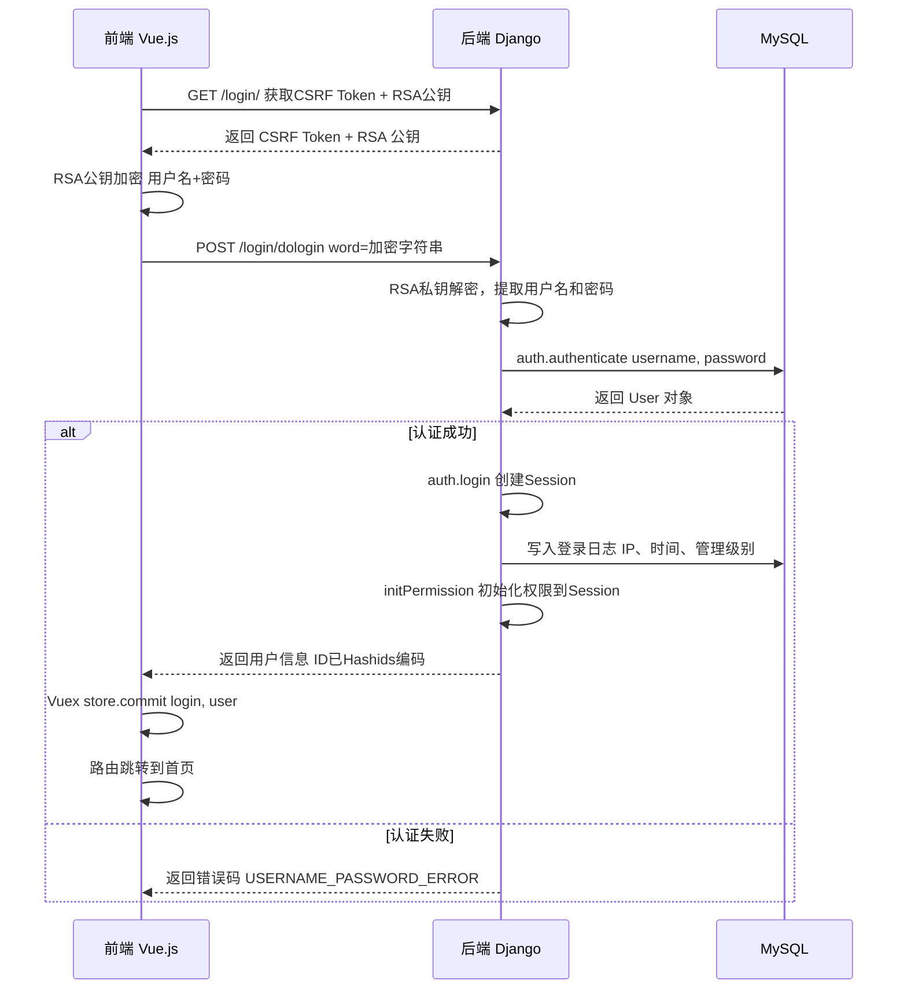
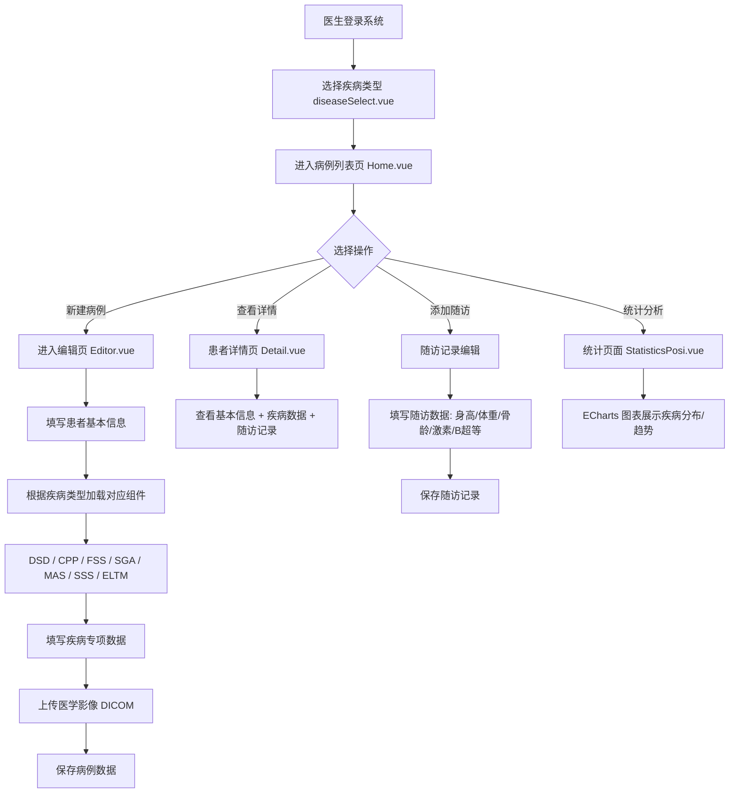
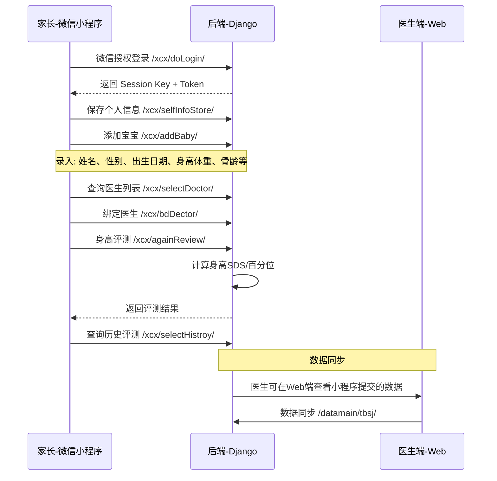
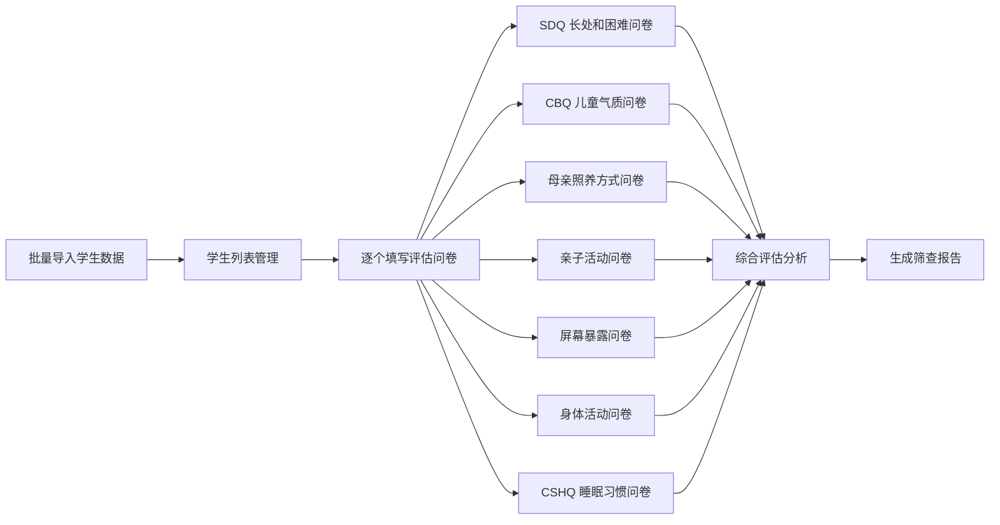

# 系统架构与技术设计

> 本章节面向开发者，介绍系统的技术架构、模块设计和数据模型。

## 技术栈

### 前端

| 技术 | 版本 | 用途 |
|------|------|------|
| Vue.js | 2.6.11 | 前端框架 |
| Element UI | 2.13.0 | UI 组件库 |
| Vuex | 3.1.2 | 状态管理 |
| Vue Router | 3.1.5 | 前端路由 |
| Axios | 0.19.2 | HTTP 客户端 |
| ECharts | 4.8.0 | 数据可视化图表 |
| Cornerstone Core | 2.3.0 | 医学影像渲染引擎 |
| Cornerstone Tools | 4.12.5 | 影像标注与测量工具 |
| dicom-parser | 1.8.5 | DICOM 格式解析 |
| Less | 3.11.1 | CSS 预处理器 |

### 后端

| 技术 | 版本 | 用途 |
|------|------|------|
| Django | 3.0.3 | Web 框架 |
| MySQL | 5.7+ | 关系型数据库 |
| mysqlclient | 1.4.6 | MySQL 驱动 |
| Gunicorn | - | WSGI 生产服务器 |
| Pillow | 7.0.0 | 图像处理 |
| pycryptodome | 3.9.7 | RSA/AES 加密 |
| pydicom | 1.4.1 | DICOM 医学影像处理 |
| PyJWT | - | JWT Token 验证（小程序端） |
| hashids | - | 数据库 ID 混淆编码 |
| xlwt | 1.3.0 | Excel 导出 |

### 部署

| 技术 | 用途 |
|------|------|
| Docker | 容器化构建 |
| Kubernetes | 容器编排与部署 |
| Nginx | 前端静态资源服务 + API 反向代理 |
| Rancher Desktop / Docker Desktop | 本地 K8s 集群 |

## 项目结构

```
ekdms/
├── ek-frontend/              # 前端 Vue.js 项目
│   ├── src/
│   │   ├── components/       # 页面组件
│   │   │   ├── common/       # 疾病类型编辑组件（CPP/DSD/ELTM/FSS/MAS/SGA/SSS）
│   │   │   ├── imageViewer/  # 医学影像查看器（Cornerstone DICOM）
│   │   │   └── report/       # 报告生成组件
│   │   ├── script/           # 工具脚本（Cornerstone 影像、HTTP 请求封装）
│   │   ├── utils/            # 工具函数（ICD 编码、城市数据、身高校验）
│   │   ├── router.js         # 前端路由配置
│   │   └── store.js          # Vuex 状态管理
│   ├── Dockerfile            # 前端容器化配置
│   └── nginx.conf            # Nginx 反向代理配置
│
├── eksjk/                    # 后端 Django 项目
│   ├── wjwsjk/               # Django 项目配置（settings、urls、wsgi）
│   ├── login/                # 用户认证与权限管理模块
│   ├── datamain/             # 核心业务数据模块
│   ├── school/               # 学校儿童健康筛查模块
│   ├── xcx/                  # 微信小程序接口模块
│   ├── notiopi/              # 通知与意见反馈模块
│   ├── collector/            # 数据采集器（文件监听与解析）
│   ├── common/               # 公共工具库（加密、序列化、ICD编码、区划数据）
│   ├── Dockerfile            # 后端容器化配置
│   └── requirements.txt      # Python 依赖
│
├── k8s/                      # Kubernetes 部署清单
│   ├── configmap.yaml        # 环境配置（数据库连接、Django 设置）
│   ├── mysql.yaml            # MySQL 数据库部署（含 PVC 持久化）
│   ├── backend.yaml          # Django 后端部署（含 Init Container 自动迁移）
│   └── frontend.yaml         # Vue 前端部署（Nginx + NodePort 暴露）
│
└── deploy.sh                 # K8s 一键部署脚本
```

## 前端路由与页面

| 路由路径 | 组件 | 功能说明 |
|----------|------|----------|
| `/login` | `Login.vue` | 用户登录页面，RSA 加密登录 |
| `/home` | `Home.vue` | 首页/病例列表，支持多条件筛选和分页 |
| `/diseaseSelect` | `diseaseSelect.vue` | 新建病例时选择疾病类型 |
| `/editor` | `Editor.vue` | 病例编辑页，动态加载疾病类型组件 |
| `/detail` | `Detail.vue` | 患者详情页，展示完整病例和随访数据 |
| `/tianYuan` | `TianYuan.vue` | 天元公学专用列表页 |
| `/studentEditor` | `StudentEditor.vue` | 学校学生数据编辑页 |
| `/editLog` | `editLog.vue` | 操作日志查看页 |
| `/statisticPosi` | `StatisticsPosi.vue` | 数据统计分析页（ECharts 图表） |
| `/user` | `User.vue` | 用户管理页面（管理员） |
| `/userProfile` | `UserProfile.vue` | 个人信息编辑页 |
| `/unit` | `Unit.vue` | 单位/医疗机构管理页面 |

## 后端模块设计

### 一、用户认证与权限管理（`login`）

**安全机制**：
- **RSA 加密传输**：登录时前端使用 RSA 公钥加密用户名+密码，后端使用私钥解密
- **ID 混淆**：使用 Hashids 对数据库主键 ID 进行编码，隐藏业务量
- **Session 管理**：Django Session 机制管理登录状态
- **登录日志**：每次登录/登出自动记录 IP、时间、管理级别

**RBAC 权限模型**：

```
User ←(多对多)→ Role ←(多对多)→ Permission(URL)
```

- `UseuMiddleware` 中间件在每次请求时检查用户的 URL 访问权限
- 配置文件中定义 `SAFE_URL`（免验证白名单）和 `BACK_URL`（需验证黑名单）

**用户模型**：

```
User (继承 AbstractUser)
├── username     — 登录用户名
├── password     — 密码（Django 内置哈希）
├── name         — 真实姓名
├── sex          — 性别
├── unit         — 所属医疗机构 ID
├── level        — 级别（0=普通用户, 1=管理员）
├── professional — 职称（助理医师/医师/主治医师/副主任医师/主任医师）
├── department   — 科室
└── is_active    — 账号是否启用
```

**API 列表**：

| 功能 | API 路径 | 说明 |
|------|----------|------|
| 获取 CSRF Token + RSA 公钥 | `GET /login/` | 登录前获取加密公钥 |
| 用户登录 | `POST /login/dologin` | RSA 加密传输用户名密码 |
| 用户登出 | `POST /login/logout` | 清除 Session，记录登出时间 |
| 用户 CRUD | `/login/user` | 增删改查用户信息 |
| 用户列表 | `GET /login/userList` | 分页查询，支持按姓名/用户名/级别筛选 |
| 用户状态管理 | `POST /login/userStatus` | 启用/禁用用户账号 |
| 单位管理 | `/login/unit` | 医疗机构的增删改查 |
| 单位列表 | `GET /login/unitList` | 分页查询单位 |
| 弹窗公告 | `GET /login/noticePer` | 获取当前用户未关闭的公告 |

### 二、核心业务数据（`datamain`）

系统的核心模块，管理儿科内分泌疾病的全部临床数据。

**疾病分类体系**（7 大疾病类型，每种对应独立数据子表）：

| 编码 | 疾病类型 | 模型 | 前端组件 | 说明 |
|------|----------|------|----------|------|
| 10000001 | 性发育异常 (DSD) | `Case` | `DSD.vue` | 含染色体核型、基因突变、HCG 激发试验等 |
| 10000002 | 遗传性骨病 (FSS) | `Short` | `FSS.vue` | 含骨骼检查、基因检测等 |
| 10000003 | 中枢性性早熟 (CPP) | `Sexprecocity` | `CPP.vue` | 含 GnRH 激发试验、LH/FSH 峰值等 |
| 10000004 | McCune-Albright (MAS) | `Mas` | `MAS.vue` | 含皮肤/骨骼检查、内分泌评估等 |
| 10000005 | 小于胎龄儿 (SGA) | `SGA` | `SGA.vue` | 含母亲孕期疾病、多胎信息等 |
| 10000006 | 家族性矮小 (SSS) | `JzxShort` | `SSS.vue` | 含生长激素检测等 |
| 10000007 | E路童萌 (ELTM) | `SzfyEltm` | `ELTM.vue` | 含 Tanner 分期、药物不良事件等 |

**患者主表 (`Patient`)**：

```
Patient（患者主表）
├── 基本信息：姓名、性别、出生日期、身份证、联系方式
├── 疾病分类：dis_class（关联具体疾病子表）
├── 编号体系：case_num（病例编号）、medrec_num（病历号）、user_num（患者编号）
├── 生长数据：身高、体重、BMI、骨龄（R型/C型）
├── 家庭信息：父母身高体重、初潮年龄、家族史
├── 出生信息：胎龄周、出生体重/身长、分娩方式、窒息抢救史
├── 就诊信息：初诊时间、确诊年龄、主诉、ICD 编码
├── 小程序关联：xcx_card（小程序身份识别）、期望身高、当前城市
└── 管理字段：导入人员、上传机构、删除标志、修改时间
```

**随访模型 (`PatFoll`)**：

```
PatFoll（随访记录）
├── 基础测量：身高(Ht)、体重(Wt)、BMI、体脂率、腰围、臀围
├── 骨龄评估：R系列骨龄、C系列骨龄
├── 发育分期：生殖器分期、阴毛分期
├── 实验室检查：
│   ├── 生长因子：IGF-1、IGFBP-3
│   ├── 甲状腺功能
│   ├── 血糖/胰岛素：空腹血糖、空腹胰岛素、糖化血红蛋白
│   ├── 性激素：LH、FSH、E2、T、DHT、SHBG
│   └── 肝肾功能、电解质
├── 影像检查：性腺B超、骨密度
├── 诊疗方案：用药记录（地舒单抗、唑来膦酸等）
└── 是否达终身高
```

**MAS 专用随访 (`MasFoll`)**：McCune-Albright 综合征独立随访模型，包含皮肤检查（咖啡斑）、骨骼检查、子宫/卵巢/甲状腺/肾上腺 B 超、头颅 CT/MR、全身骨扫描、骨代谢检查、内分泌激素全套。

**API 列表**：

| 功能 | API 路径 | 说明 |
|------|----------|------|
| 病例列表 | `GET /datamain/caseList/` | 分页查询，支持多条件筛选 |
| 患者详情 | `GET /datamain/patient/` | 获取患者基本信息 |
| 病例数据 | `/datamain/case/` | 获取/保存疾病子表数据 |
| 随访列表 | `GET /datamain/followList/` | 获取随访记录列表 |
| 随访操作 | `/datamain/follow/` | 新增/编辑/删除随访记录 |
| MAS 随访 | `/datamain/masFollow/` | MAS 专用随访操作 |
| 影像上传 | `POST /datamain/image` | 上传医学影像文件 |
| 文件上传/下载 | `/datamain/loadFile` | 通用文件上传下载 |
| 批量下载 | `/datamain/downZipPl` | 批量打包下载文件 |
| SDS 计算 | `GET /datamain/getSDS` | 计算身高标准差分数 |
| 统计分析 | `GET /datamain/statisticPosi/` | 疾病分布统计 |
| 比例统计 | `GET /datamain/staBl/` | 各类数据比例统计 |
| 操作日志 | `GET /datamain/modifylogList/` | 查询数据修改日志 |
| 数据同步 | `POST /datamain/tbsj/` | E路童萌数据同步 |

### 三、学校儿童健康筛查（`school`）

面向学校场景的儿童健康评估系统，通过标准化问卷采集多维度健康数据。

**数据模型**：

```
Student（学生主表）
├── 基本信息：编号、班级、姓名、性别、出生日期
├── 体格数据：身高、体重
├── 家庭背景：父母教育程度、家庭收入、主要照护人
├── 出生信息：分娩方式、出生体重/孕周、喂养方式
└── 关联 7 张评估问卷子表 ↓

┌─ Cchkn  — 长处和困难问卷 (SDQ)：25 个行为评估维度
├─ Cbq    — 儿童气质问卷 (CBQ)：36 个气质特征维度
├─ Mqzyfs — 母亲照养方式问卷：40 个养育行为维度
├─ Qzhd   — 亲子活动问卷：12 个亲子互动维度
├─ Pmbl   — 屏幕暴露问卷：屏幕接触与使用情况
├─ Sthd   — 身体活动问卷：活动频率与静坐时间
└─ Smxg   — 儿童睡眠习惯问卷 (CSHQ)：60+ 个睡眠维度
```

**API 列表**：

| 功能 | API 路径 | 说明 |
|------|----------|------|
| 学生列表 | `GET /school/studentList/` | 分页查询，支持按编号/班级/姓名/性别筛选 |
| 学生详情 | `GET /school/student/` | 获取学生基本信息 + 全部 7 张问卷数据 |

### 四、微信小程序接口（`xcx`）

为家长端微信小程序提供 API 接口，实现家长自助录入儿童生长数据并与医生端互通。

**微信用户模型**：

```
ChartUser（微信用户）
├── openid         — 微信 OpenID
├── key            — 会话密钥
├── medrec_num     — 关联病历号
├── phone_num      — 手机号
├── doctor         — 绑定医生
├── is_tongb       — 是否已同步数据到医生端
├── new_user_flag  — 是否新用户
├── contacts_name  — 联系人姓名
├── idcard         — 身份证号
└── nat_pla        — 籍贯
```

**API 列表**：

| 功能 | API 路径 | 说明 |
|------|----------|------|
| 小程序登录 | `POST /xcx/doLogin/` | 微信授权登录 |
| 获取 Session Key | `GET /xcx/cSessionKey/` | 获取微信 Session Key |
| 个人信息存储 | `POST /xcx/selfInfoStore/` | 保存家长个人信息 |
| 个人信息查询 | `GET /xcx/selectSlefInfo/` | 查询家长个人信息 |
| 添加宝宝 | `POST /xcx/addBaby/` | 录入儿童信息 |
| 编辑宝宝 | `POST /xcx/editBaby/` | 修改儿童信息 |
| 删除宝宝 | `POST /xcx/deletBaby/` | 删除儿童记录 |
| 查询宝宝 | `GET /xcx/selectBaby/` | 查询单个儿童信息 |
| 查询全部宝宝 | `GET /xcx/selectBabyAll/` | 查询家长名下所有儿童 |
| 绑定医生 | `POST /xcx/bdDector/` | 家长绑定主治医生 |
| 查询医生列表 | `GET /xcx/selectDoctor/` | 获取可选医生列表 |
| 历史评测 | `GET /xcx/selectHistroy/` | 查询历史身高评测记录 |
| 再次评测 | `POST /xcx/againReview/` | 重新进行身高评测 |
| 病例查询 | `GET /xcx/oneCaseByBLP/` | 按病历号查询单个病例 |
| 病例列表 | `GET /xcx/caseByBLP/` | 按病历号查询病例列表 |

### 五、通知与意见反馈（`notiopi`）

- **公告系统**：管理员发布面向不同角色的公告 → 用户登录后弹窗提醒 → 用户关闭后不再弹出
- **意见反馈**：用户提交反馈（支持图片/视频） → 管理员查看列表 → 回复处理

| 功能 | API 路径 | 说明 |
|------|----------|------|
| 公告管理 | `/notiopi/notice/` | 发布/编辑/删除公告 |
| 公告列表 | `GET /notiopi/noticeListView/` | 分页查询公告 |
| 关闭公告 | `POST /notiopi/closeNotice/` | 用户关闭公告弹窗 |
| 意见反馈 | `/notiopi/opinionView/` | 提交意见反馈 |
| 反馈列表 | `GET /notiopi/opinionListView/` | 查询反馈列表 |
| 回复反馈 | `POST /notiopi/replyOpinionView/` | 管理员回复反馈 |
| 图片上传 | `POST /notiopi/image` | 反馈附件上传 |

### 六、医学影像模块

基于 Cornerstone.js 构建的 DICOM 医学影像处理系统：

- **影像查看器** (`ImageViewer.vue`)：支持 DICOM 格式医学图像的渲染与浏览
- **影像标注** (`ImagePalette.vue`)：支持在影像上进行测量和标注
- **影像上传** (`ImageUpload.vue`)：支持 DICOM 文件上传与解析
- **后端处理**：使用 pydicom 进行 DICOM 文件的服务端解析

## 核心业务流程

### 1. 用户登录流程



### 2. 患者病例管理流程



### 3. 小程序端家长自助流程



### 4. 学校健康筛查流程

