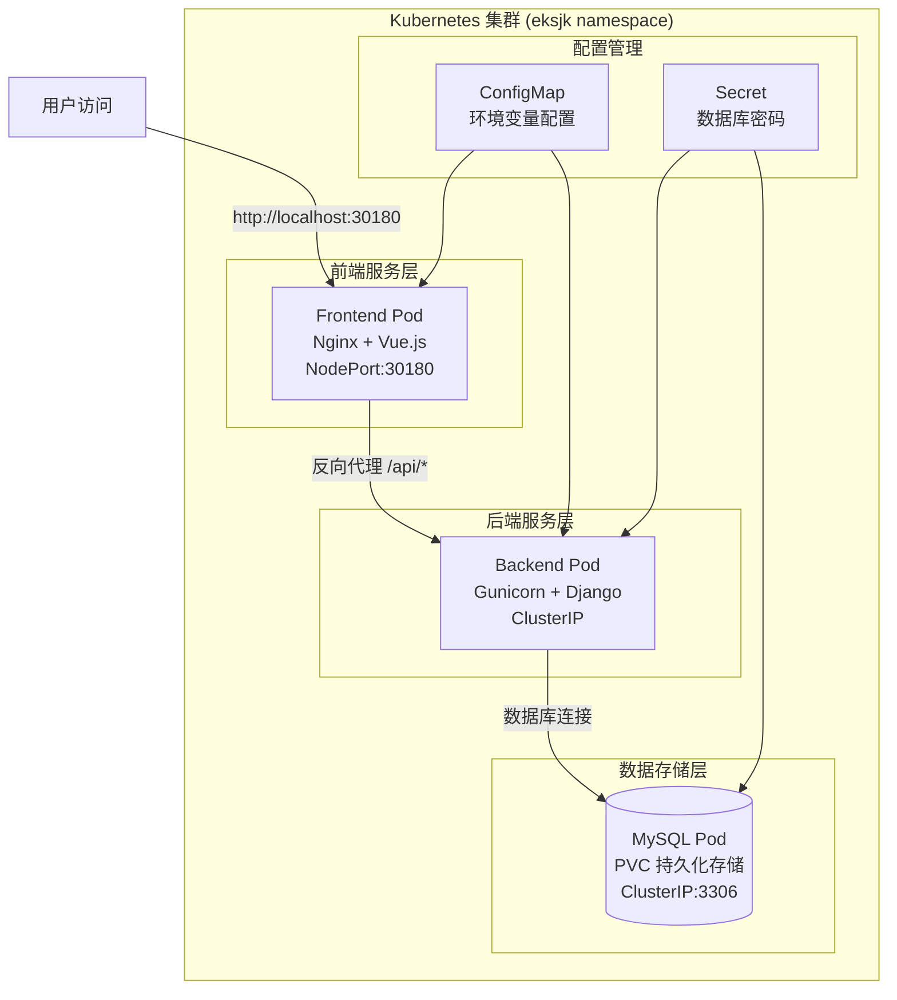
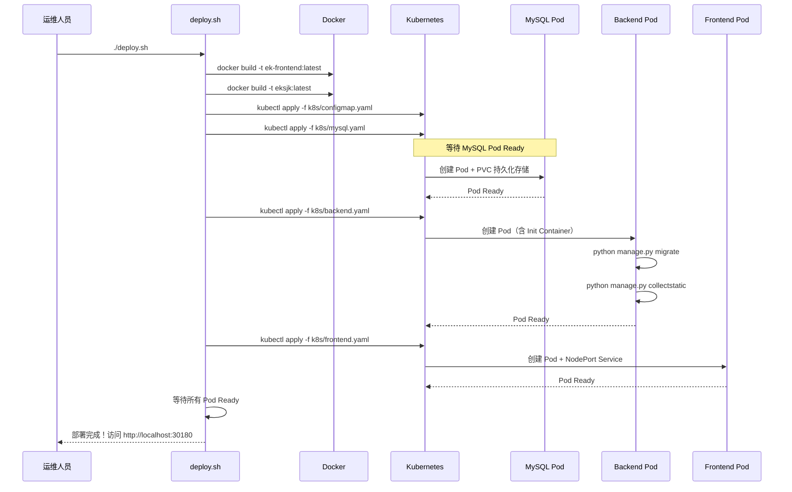

# 部署指南

> 本章节面向运维人员，介绍系统的部署方式和运维操作。

## 部署架构



## K8s 一键部署（推荐）

### 环境要求

- Docker Desktop 或 Rancher Desktop（已启用 Kubernetes）
- 或：Node.js 12+、Python 3.7+、MySQL 5.7+（手动部署）

### 一键部署脚本

```bash
# 确保已安装 Rancher Desktop 或 Docker Desktop 并启用 Kubernetes
chmod +x deploy.sh

# 完整部署（构建镜像 + 部署到 K8s）
./deploy.sh

# 仅构建镜像
./deploy.sh build

# 仅应用 K8s 清单
./deploy.sh apply

# 查看部署状态
./deploy.sh status

# 查看服务日志
./deploy.sh logs

# 重启所有服务
./deploy.sh restart

# 删除所有资源
./deploy.sh delete
```

### 部署流程



### K8s 资源清单说明

#### 1. ConfigMap (`k8s/configmap.yaml`)

```yaml
apiVersion: v1
kind: ConfigMap
metadata:
  name: eksjk-config
  namespace: eksjk
data:
  # Django 配置
  DJANGO_SECRET_KEY: "your-secret-key-here"
  DJANGO_DEBUG: "False"
  DJANGO_ALLOWED_HOSTS: "*"
  
  # 数据库连接
  DATABASE_HOST: "eksjk-mysql"
  DATABASE_PORT: "3306"
  DATABASE_NAME: "eksjk"
  
  # 前端配置
  VUE_APP_API_BASE_URL: "http://localhost:30180/api"
```

#### 2. MySQL 部署 (`k8s/mysql.yaml`)

```yaml
apiVersion: apps/v1
kind: Deployment
metadata:
  name: eksjk-mysql
  namespace: eksjk
spec:
  replicas: 1
  selector:
    matchLabels:
      app: eksjk-mysql
  template:
    metadata:
      labels:
        app: eksjk-mysql
    spec:
      containers:
      - name: mysql
        image: mysql:5.7
        env:
        - name: MYSQL_ROOT_PASSWORD
          valueFrom:
            secretKeyRef:
              name: mysql-secret
              key: password
        - name: MYSQL_DATABASE
          value: "eksjk"
        ports:
        - containerPort: 3306
        volumeMounts:
        - name: mysql-data
          mountPath: /var/lib/mysql
      volumes:
      - name: mysql-data
        persistentVolumeClaim:
          claimName: mysql-pvc
---
apiVersion: v1
kind: Service
metadata:
  name: eksjk-mysql
  namespace: eksjk
spec:
  selector:
    app: eksjk-mysql
  ports:
  - port: 3306
    targetPort: 3306
```

#### 3. 后端部署 (`k8s/backend.yaml`)

```yaml
apiVersion: apps/v1
kind: Deployment
metadata:
  name: eksjk-backend
  namespace: eksjk
spec:
  replicas: 2
  selector:
    matchLabels:
      app: eksjk-backend
  template:
    metadata:
      labels:
        app: eksjk-backend
    spec:
      initContainers:
      - name: db-migration
        image: eksjk:latest
        command: ['sh', '-c', 'python manage.py migrate && python manage.py collectstatic --noinput']
        envFrom:
        - configMapRef:
            name: eksjk-config
        - secretRef:
            name: mysql-secret
      containers:
      - name: backend
        image: eksjk:latest
        command: ["gunicorn", "wjwsjk.wsgi:application", "--bind", "0.0.0.0:8000"]
        ports:
        - containerPort: 8000
        envFrom:
        - configMapRef:
            name: eksjk-config
        - secretRef:
            name: mysql-secret
---
apiVersion: v1
kind: Service
metadata:
  name: eksjk-backend
  namespace: eksjk
spec:
  selector:
    app: eksjk-backend
  ports:
  - port: 8000
    targetPort: 8000
```

#### 4. 前端部署 (`k8s/frontend.yaml`)

```yaml
apiVersion: apps/v1
kind: Deployment
metadata:
  name: ek-frontend
  namespace: eksjk
spec:
  replicas: 2
  selector:
    matchLabels:
      app: ek-frontend
  template:
    metadata:
      labels:
        app: ek-frontend
    spec:
      containers:
      - name: frontend
        image: ek-frontend:latest
        ports:
        - containerPort: 80
---
apiVersion: v1
kind: Service
metadata:
  name: ek-frontend
  namespace: eksjk
spec:
  type: NodePort
  selector:
    app: ek-frontend
  ports:
  - port: 80
    targetPort: 80
    nodePort: 30180
```

## 手动部署（开发环境）

### 前端部署

```bash
# 进入前端项目目录
cd ek-frontend

# 安装依赖
npm install

# 开发环境运行
npm run serve      # 访问 http://localhost:8080

# 生产构建
npm run build      # 生成 dist/ 静态文件

# Docker 构建
docker build -t ek-frontend:latest .
```

### 后端部署

```bash
# 进入后端项目目录
cd eksjk

# 安装 Python 依赖
pip install -r requirements.txt

# 数据库迁移
python manage.py makemigrations
python manage.py migrate

# 收集静态文件
python manage.py collectstatic

# 创建超级用户
python manage.py createsuperuser

# 开发环境运行
python manage.py runserver 0.0.0.0:8000

# 生产环境运行（Gunicorn）
gunicorn wjwsjk.wsgi:application --bind 0.0.0.0:8000 --workers 4

# Docker 构建
docker build -t eksjk:latest .
```

### Nginx 配置

```nginx
# nginx.conf
server {
    listen 80;
    server_name localhost;
    
    # 前端静态资源
    location / {
        root /usr/share/nginx/html;
        index index.html;
        try_files $uri $uri/ /index.html;
    }
    
    # API 反向代理
    location /api/ {
        proxy_pass http://eksjk-backend:8000/;
        proxy_set_header Host $host;
        proxy_set_header X-Real-IP $remote_addr;
        proxy_set_header X-Forwarded-For $proxy_add_x_forwarded_for;
    }
    
    # 静态文件缓存
    location /static/ {
        alias /app/static/;
        expires 30d;
        add_header Cache-Control "public";
    }
    
    # 媒体文件
    location /media/ {
        alias /app/media/;
        expires 30d;
        add_header Cache-Control "public";
    }
}
```

## 运维管理

### 服务监控

```bash
# 查看所有 Pod 状态
kubectl get pods -n eksjk

# 查看服务状态
kubectl get services -n eksjk

# 查看 Pod 日志
kubectl logs -f <pod-name> -n eksjk

# 进入 Pod 调试
kubectl exec -it <pod-name> -n eksjk -- /bin/bash

# 查看资源使用情况
kubectl top pods -n eksjk
```

### 数据库管理

```bash
# 进入 MySQL Pod
kubectl exec -it eksjk-mysql-xxx -n eksjk -- mysql -u root -p

# 备份数据库
kubectl exec eksjk-mysql-xxx -n eksjk -- mysqldump -u root -p eksjk > backup.sql

# 恢复数据库
kubectl exec -i eksjk-mysql-xxx -n eksjk -- mysql -u root -p eksjk < backup.sql

# 查看数据库大小
kubectl exec eksjk-mysql-xxx -n eksjk -- mysql -u root -p -e "SELECT table_schema '数据库', SUM(data_length + index_length) / 1024 / 1024 '大小(MB)' FROM information_schema.tables GROUP BY table_schema;"
```

### 数据迁移与升级

```bash
# Django 数据库迁移
kubectl exec eksjk-backend-xxx -n eksjk -- python manage.py migrate

# 创建超级用户
kubectl exec eksjk-backend-xxx -n eksjk -- python manage.py createsuperuser

# 收集静态文件
kubectl exec eksjk-backend-xxx -n eksjk -- python manage.py collectstatic --noinput

# 清除缓存
kubectl exec eksjk-backend-xxx -n eksjk -- python manage.py clear_cache
```

### 故障排查

#### 常见问题及解决方案

| 问题现象 | 可能原因 | 解决方案 |
|----------|----------|----------|
| 前端页面无法访问 | NodePort 服务未启动 | `kubectl get svc -n eksjk` 检查 NodePort |
| API 请求 502 错误 | 后端 Pod 未就绪 | `kubectl logs eksjk-backend-xxx` 查看日志 |
| 数据库连接失败 | MySQL Pod 未启动 | `kubectl describe pod eksjk-mysql-xxx` |
| 静态资源 404 | Nginx 配置错误 | 检查 nginx.conf 静态文件路径 |
| 上传文件失败 | 存储卷权限问题 | `kubectl exec` 检查挂载点权限 |

#### 日志查看命令

```bash
# 查看所有 Pod 事件
kubectl get events -n eksjk --sort-by=.metadata.creationTimestamp

# 查看特定 Pod 详细状态
kubectl describe pod <pod-name> -n eksjk

# 实时查看日志
kubectl logs -f <pod-name> -n eksjk --tail=100

# 查看历史日志
kubectl logs --previous <pod-name> -n eksjk
```

### 备份与恢复

#### 数据库备份脚本

```bash
#!/bin/bash
# backup-db.sh

DATE=$(date +%Y%m%d_%H%M%S)
BACKUP_FILE="eksjk_backup_$DATE.sql"

# 从 MySQL Pod 导出数据
kubectl exec eksjk-mysql-pod -n eksjk -- mysqldump -u root -p$MYSQL_ROOT_PASSWORD eksjk > $BACKUP_FILE

# 压缩备份文件
gzip $BACKUP_FILE

echo "数据库备份完成: ${BACKUP_FILE}.gz"
```

#### 文件备份脚本

```bash
#!/bin/bash
# backup-files.sh

DATE=$(date +%Y%m%d_%H%M%S)
BACKUP_DIR="eksjk_files_backup_$DATE"

# 创建备份目录
mkdir -p $BACKUP_DIR

# 备份上传的文件
kubectl cp eksjk-backend-pod:/app/media $BACKUP_DIR/media -n eksjk

# 备份静态文件
kubectl cp eksjk-backend-pod:/app/static $BACKUP_DIR/static -n eksjk

# 打包备份
tar -czf ${BACKUP_DIR}.tar.gz $BACKUP_DIR
rm -rf $BACKUP_DIR

echo "文件备份完成: ${BACKUP_DIR}.tar.gz"
```

## 访问信息

| 服务 | 地址 | 说明 |
|------|------|------|
| 前端页面 | http://localhost:30180 | Nginx 托管 Vue 静态资源 |
| 后端 API | 通过 Nginx 反向代理自动转发 | `/login/`、`/datamain/` 等 |
| MySQL | 集群内部 `eksjk-mysql:3306` | 仅集群内部访问 |

## 默认账号

| 角色 | 用户名 | 密码 |
|------|--------|------|
| 超级管理员 | `admin` | `admin123` |
| 医生 | `doctor01` ~ `doctor10` | `doctor123` |
| 普通用户 | `user0001` ~ `user1000` | `user123` |