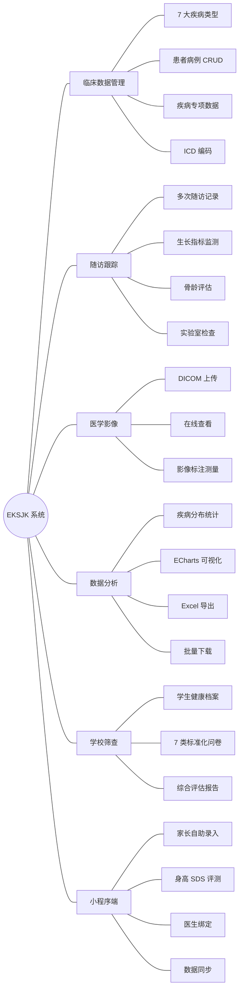

# EKSJK — 儿科生长发育数据管理系统

## 项目概述

EKSJK（儿科数据管理系统）是一个面向医疗健康领域的全栈 Web 应用，专注于 **儿童内分泌疾病** 的临床数据管理、患者随访跟踪、生长发育监测和医学影像处理。系统同时提供 **微信小程序端** 供家长自助录入儿童生长数据，并与医生端实现数据互通。

### 系统角色

| 角色 | 使用端 | 核心职责 |
|------|--------|----------|
| 超级管理员 | Web 端 | 用户管理、单位管理、系统配置、全部数据权限 |
| 医生（管理员） | Web 端 | 病例管理、随访记录、统计分析、影像查看 |
| 普通用户 | Web 端 | 病例录入、随访记录、数据查看 |
| 家长 | 微信小程序 | 宝宝信息录入、身高评测、绑定医生 |

### 核心能力一览

